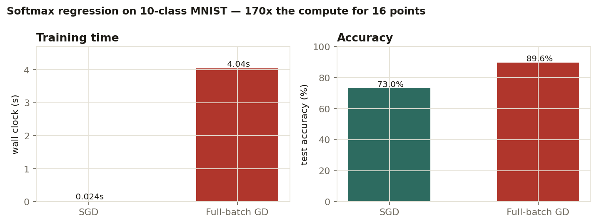
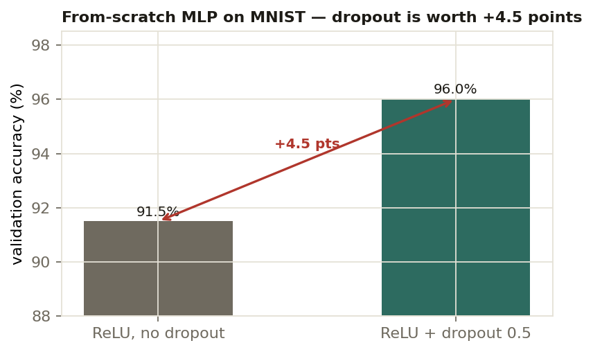
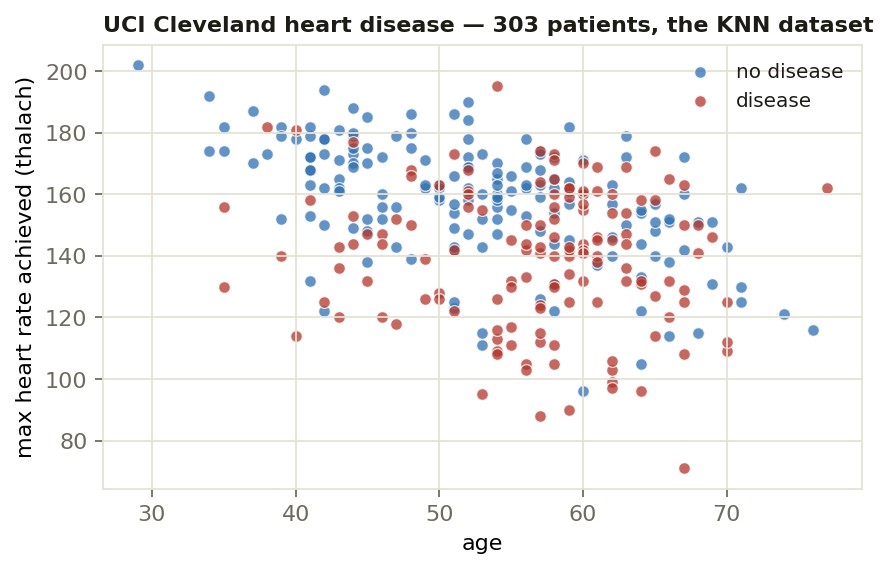

<h1 align="center">Machine Learning Algorithms from Scratch</h1>

<p align="center">
  <i>Ten algorithms — from k-nearest neighbours to a decoder-only Transformer —<br/>
  implemented in NumPy and PyTorch primitives. No scikit-learn in the algorithm bodies,<br/>
  no autograd where the whole point is the gradient.</i>
</p>

<p align="center">
  <a href="https://kelidari.com/machine-learning-implementations/"></a>
  
  
  
</p>

---

## Try it in the browser

Four of these algorithms are reimplemented in plain JavaScript and run live — click to place
points and watch each one respond. KNN redraws its decision regions, k-means++ reseeds and
converges, and the perceptron and logistic regression fit a boundary in front of you.

<p align="center">
  <a href="https://kelidari.com/machine-learning-implementations/">
    <b>▶ kelidari.com/machine-learning-implementations</b>
  </a>
</p>

The most instructive thing to do there: draw two **overlapping** blobs, then flip between the
perceptron and logistic regression tabs. The perceptron never settles — it keeps chasing
individual misclassified points forever, because there is no line that separates them. Logistic
regression converges anyway, because it optimises a smooth likelihood instead of chasing
mistakes. That difference is the entire reason one of them replaced the other.

## Why write these by hand

Calling `.fit()` teaches you an API. Writing the update rule teaches you where the algorithm
converges, where it stalls, and what each hyperparameter actually trades off.

Every algorithm below was implemented against a provided test harness (USC CSCI 567, Spring
2025): the data loaders, class signatures and unit tests came with the assignment, and the
algorithm bodies are mine. Every number quoted here comes from my own recorded run.

## The ten algorithms

| | Algorithm | What was written by hand | Dataset |
|---|---|---|---|
| 01 | **K-Nearest Neighbours** | Euclidean / Minkowski-L3 / cosine distances, min-max and L2 scalers, F1 scoring, and the full k × distance × scaler tuning grid | UCI Cleveland heart disease |
| 02 | **Linear & Ridge Regression** | Closed-form normal equations, λ swept over 2⁻⁴⁰…2⁰, polynomial feature maps p = 2…5 | UCI white wine (4,399) |
| 03 | **Perceptron · Logistic · Softmax** | Hand-derived gradients; binary GD, and multiclass softmax by both **full-batch GD and SGD** | Two-Moons, MNIST |
| 04 | **Multilayer Perceptron** | Full **forward and backward passes** — linear, ReLU, tanh, inverted **dropout**, softmax cross-entropy, **SGD with momentum** and step decay. No autograd | MNIST |
| 05 | **AdaBoost** | Sample reweighting, β = ½·ln((1−ε)/ε), weighted-vote prediction over decision-tree weak learners | — |
| 06 | **K-Means & K-Means++** | Lloyd's algorithm, k-means++ seeding, k-means as a classifier, image compression by vector quantization | Toy + images |
| 07 | **PCA Word Embeddings** | Embeddings from a 3000×3000 co-occurrence matrix; analogy solver, synonym/antonym cosine tests, gender-bias projection | Wikipedia co-occurrence |
| 08 | **Hidden Markov Model** | Forward, backward, sequence likelihood, posterior γ, pairwise ξ, and **Viterbi decoding**, plus a POS tagger with unseen-word smoothing | Brown corpus, 49,469 sentences |
| 09 | **Decoder-only Transformer** | Scaled dot-product attention with a causal mask, multi-head concat, pre-LN residual blocks, token + position embeddings, autoregressive sampling | tiny-Shakespeare |
| 10 | **Tabular Q-Learning** | ε-greedy policy, vectorized TD update, experience replay buffer | Finite MDP |

## Three results worth reading

Not accuracy for its own sake — the numbers that changed how I think about the method.

### Stochastic vs full-batch gradient descent



Same model, same data, same implementation. SGD reaches a usable classifier in **24
milliseconds**; full-batch gradient descent spends **170× the compute** to buy 16 accuracy
points. Neither is "better" — which one is correct depends entirely on whether you are
compute-bound or accuracy-bound, and this is the cheapest possible way to see that.

### Dropout beats capacity



From a grid over ReLU/tanh × dropout {0, 0.25, 0.5} × momentum {0, 0.9} on a network with
hand-written backprop. One regularizer, **+4.5 points** of validation accuracy — more than any
architectural change I made to the same network.

### The KNN dataset



303 patients, 13 features. Plotted on two of them the classes already overlap heavily, which is
why the k sweep matters: small k memorises the noise in that overlap, large k blurs the genuine
structure at the edges.

**More measured results** — Two-Moons: perceptron 84.0% test, logistic 86.7%. Binarized MNIST:
perceptron 82.8%, logistic 83.4%. From-scratch MLP: 96.0% validation, 98.8% train.

## Layout

```
algorithms/
  01-knn/                        05-adaboost/            09-transformer/
  02-linear-ridge-regression/    06-kmeans/              10-q-learning/
  03-perceptron-logistic-softmax/ 07-pca-word-embeddings/
  04-mlp-backprop/               08-hmm-viterbi/
docs/index.html                  the interactive playground (no dependencies)
figures/                         generated result plots
```

Each algorithm folder is self-contained — its own data, implementation and test script.

```bash
cd algorithms/01-knn && python test.py
```

## Scope, honestly

These were course assignments, so the scaffolding was provided: data loaders, class signatures,
unit tests. What is mine is the algorithm inside each one, plus the experiments and ablations
that produced the numbers above. The repo is public because these implementations are the
clearest evidence I have of understanding these methods from the inside rather than from the
API surface.

---

<p align="center">
  <a href="https://kelidari.com/machine-learning-implementations/">Playground</a> ·
  <a href="https://kelidari.com">kelidari.com</a> ·
  <a href="https://github.com/Nikelroid">github.com/Nikelroid</a>
</p>
